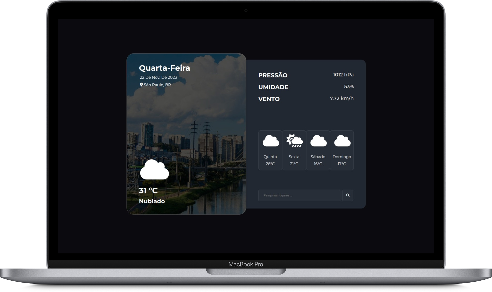
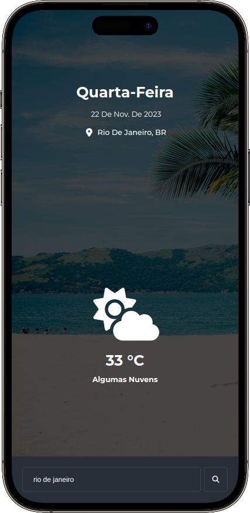

# Weather Forecast App - Aplicativo de Previsão do Tempo ☀️🌧️

Um aplicativo simples para visualizar o clima atual e a previsão do tempo para os próximos dias usando a API do OpenWeatherMap.

## Deploy e Imagens

O projeto está disponível para acesso no link: [Weather Forecast App](https://weather-forecast-app-henrique-gomes.vercel.app/)

 

  

  

 

## Funcionalidades 🌍

- **Obtenção de dados do clima atual:** Utiliza a API do OpenWeatherMap para mostrar informações detalhadas sobre o clima atual de uma cidade específica.
- **Previsão do tempo de quatro dias:** Obtém a previsão do tempo para os próximos quatro dias e exibe as temperaturas.
- **Ícones climáticos:** Mostra ícones representativos do clima atual e da previsão, proporcionando uma experiência visual.
- **Fundo dinâmico:** Atualiza o fundo do aplicativo com uma imagem correspondente à cidade buscada.

## Tecnologias Utilizadas 🛠️

- **HTML, CSS, JavaScript:** Linguagens base para a estrutura, estilo e funcionalidade do aplicativo web.
- **Fetch API:** Utilizada para fazer requisições assíncronas aos serviços da API do OpenWeatherMap e Unsplash.
- **OpenWeatherMap API:** Fonte dos dados de clima atuais e previsões.
- **Unsplash API:** Utilizada para obter imagens de fundo dinâmicas baseadas na pesquisa da cidade.
- **Font Awesome:** Fornece os ícones usados para representar diferentes condições climáticas.
- **Git e GitHub:** Controle de versão e hospedagem do código fonte.

## Técnicas Utilizadas 💡

- **Consumo de API:** Integração com APIs externas para obtenção de dados em tempo real.
- **Programação Assíncrona (Async/Await):** Para realizar operações de busca de dados de forma não bloqueante, permitindo a atualização contínua da interface.
- **Manipulação do DOM:** Atualização dinâmica dos elementos HTML para exibir os dados do clima.
- **Design Responsivo:** Garantir que o aplicativo seja funcional e visualmente agradável em diferentes dispositivos e tamanhos de tela.
- **Tratamento de Erros:** Lidar com situações em que a cidade pesquisada não é encontrada ou se há problemas na obtenção dos dados do clima.

## Como Usar 🚀

1. Clone este repositório.
2. Abra o arquivo `index.html` em seu navegador.
3. Insira o nome da cidade desejada no campo de busca.
4. Pressione Enter ou clique no botão de busca para obter informações sobre o clima.

## Autor  🧑‍💻

Henrique Gomes Teixeira - [Weather Forecast App](https://weather-forecast-app-henrique-gomes.vercel.app/) - henriquegomesteixeiradev@gmail.com
